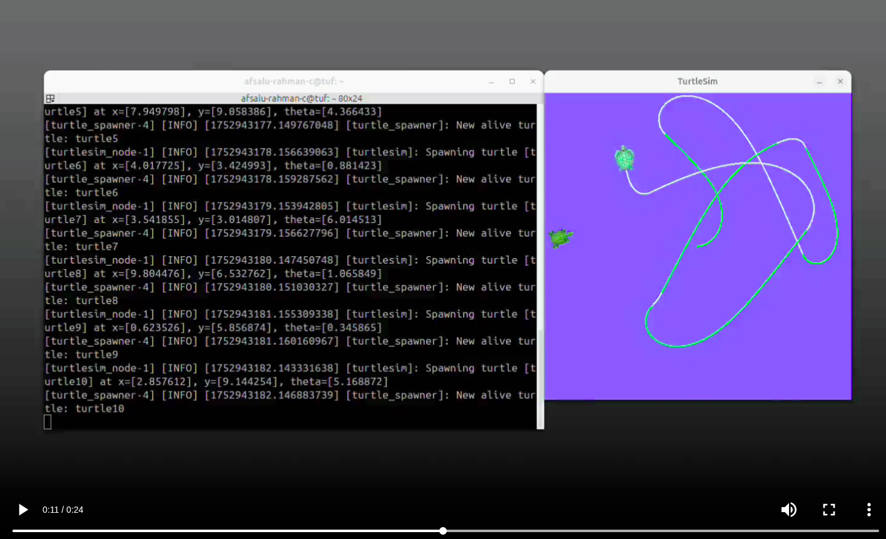

# ROS2 Jazzy Level 1 Workspace

* This is the repository which I created as part of the ROS 2 for Beginners (ROS Jazzy - 2025)" course.

## Turtlesim : Catch them all project

<!-- <video controls src="Results/Turtlesim_catch_them_all_g_b.mp4" title="Preview of turtlesim catch them all"></video> -->

<!--  -->

## Course Completion Certificate

## Resource
* Refer to the doc [here](https://docs.google.com/document/d/1n1nGljHSqtT0ggLKQivIvR39islQ8wN80_s1tpmBbhU/edit?usp=sharing)

